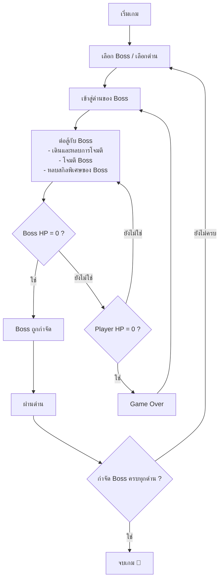

# 🐱 Liquid Cat: Battle of Ken

เกม 2D แนว Action / Boss Fighting ที่ผู้เล่นควบคุมตัวละคร **Liquid Cat** เลือก Boss ที่ต้องการต่อสู้ โดยแต่ละ Boss อยู่คนละด่าน และมีสกิลกับรูปแบบการโจมตีที่แตกต่างกันตามแต่ละด่าน

---

## 1. Game Concept

| หัวข้อ | รายละเอียด |
|---|---|
| **ชื่อเกม** | Liquid Cat: Battle of Ken |
| **แนวเกม (Genre)** | Action / Boss Fighting (แอ็กชัน ต่อสู้กับ Boss) |
| **รูปแบบ** | 2D |
| **แนวคิดหลัก** | เลือก Boss เพื่อต่อสู้เป็นด่าน ๆ โดยสกิลของ Boss จะขึ้นอยู่กับด่านนั้น |

---

## 2. Gameplay Loop

### เกมเกี่ยวกับอะไร
ผู้เล่นควบคุม Liquid Cat เลือก Boss / ด่านที่ต้องการ แล้วเข้าไปต่อสู้ ต้องเดิน หลบ โจมตี และหลบสกิลพิเศษของ Boss จนกว่า Boss จะถูกกำจัด

### Flow การเล่น

### เงื่อนไขการชนะ
- กำจัด Boss ของแต่ละด่านให้ได้
- กำจัด Boss ครบทุกด่าน → **จบเกม**

### เงื่อนไขการแพ้
- HP ของผู้เล่นเหลือ 0 → **Game Over**
- ผู้เล่นสามารถเริ่มด่านใหม่และลองสู้กับ Boss อีกครั้งได้

### จุดเด่นของเกม
Boss แต่ละตัวมีสกิลและรูปแบบการโจมตีแตกต่างกัน ผู้เล่นจึงต้องปรับวิธีการเล่นให้เหมาะกับ Boss แต่ละตัว

---

## 3. Roles / Responsibilities

| สมาชิก | หน้าที่ |
|---|---|
| **Prem** | Player movement, attack system, และ player animation |
| **kendo** | Boss design, boss skills, AI และ combat system |
| **Polly** | Level design, boss selection และ game progression |
| **N'Game** | UI, graphics, sound effects และ game menu |

