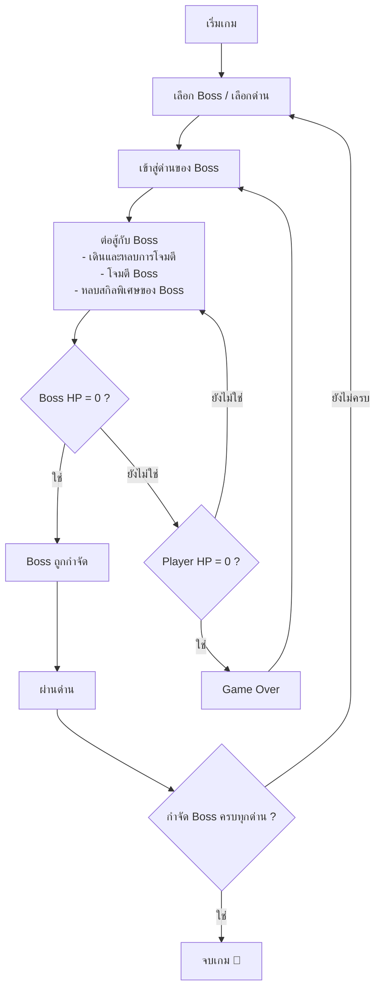

# 🐱 Liquid Cat: Battle of Ken

เกม 2D แนว Action / Boss Fighting ที่ผู้เล่นควบคุมตัวละคร **Liquid Cat** เลือก Boss ที่ต้องการต่อสู้ โดยแต่ละ Boss อยู่คนละด่าน และมีสกิลกับรูปแบบการโจมตีที่แตกต่างกันตามแต่ละด่าน

---

## 1. Game Concept

| หัวข้อ | รายละเอียด |
|---|---|
| **ชื่อเกม** | Liquid Cat: Battle of Ken |
| **แนวเกม (Genre)** | Action / Boss Fighting (แอ็กชัน ต่อสู้กับ Boss) |
| **รูปแบบ** | 2D |
| **แนวคิดหลัก** | เลือก Boss เพื่อต่อสู้เป็นด่าน ๆ โดยสกิลของ Boss จะขึ้นอยู่กับด่านนั้น |

---

## 2. Gameplay Loop

### เกมเกี่ยวกับอะไร
ผู้เล่นควบคุม Liquid Cat เลือก Boss / ด่านที่ต้องการ แล้วเข้าไปต่อสู้ ต้องเดิน หลบ โจมตี และหลบสกิลพิเศษของ Boss จนกว่า Boss จะถูกกำจัด

### Stage 2: `final class Teacher` (OOP)

| หัวข้อ | รายละเอียด |
|---|---|
| **HP** | 300 |
| **สกิล 1: Candy** | โยนลูกอมไปตกจุดสุ่มบนแผนที่ทุก 2 วินาที (มีวงสีชมพูเตือนจุดตก) ทำดาเมจ 15 |
| **สกิล 2: Double laser** | เลเซอร์ 2 เส้น (ล่าง 1 บน 1) ความสูงสุ่ม ทุก 5 วินาที ทำดาเมจ 20 |
| **สกิล 3: Giant candy** | โยนลูกอมยักษ์ไปตกจุดสุ่มทุก 10 วินาที ทำดาเมจ 30 |
| **ดรอป** | Giant Candy: โยนลูกอมยักษ์ไปข้างหน้า ทำดาเมจ 50, cooldown 10 วินาที (ปุ่ม **F**) |

### Stage 3: Bug Hacker (Web)

| หัวข้อ | รายละเอียด |
|---|---|
| **HP** | 500 |
| **สกิล 1: Energy pulse** | คลื่นพลังระเบิดตรงจุดสุ่มบนแผนที่ทุก 2 วินาที (มีวงจุดสีฟ้าหมุนเตือน 0.9 วินาที) ทำดาเมจ 15 |
| **สกิล 2: Lane laser** | เลเซอร์ 3 เส้นบน 4 ช่อง (พื้น + แท่นลอย 3 ระดับ) ทุก 5 วินาที เว้นช่องปลอดภัย 1 ช่อง (สีเขียวมีลูกศร) เตือนก่อน 1.5 วินาที ทำดาเมจ 20 |
| **สกิล 3: Code breath** | พ่นคลื่นโค้ดที่ความสูงสุ่มทุก 15 วินาที ถ้าโดน HP ผู้เล่นจะลดลงครึ่งหนึ่ง (ของ HP ที่เหลืออยู่) |
| **ดรอป** | Code Breath: พ่นคลื่นโค้ดไปข้างหน้า ลด HP ของ Boss ลงครึ่งหนึ่ง, cooldown 15 วินาที (ปุ่ม **C**) |

### Flow การเล่น

### เงื่อนไขการชนะ
- กำจัด Boss ของแต่ละด่านให้ได้
- กำจัด Boss ครบทุกด่าน → **จบเกม**

### เงื่อนไขการแพ้
- HP ของผู้เล่นเหลือ 0 → **Game Over**
- ผู้เล่นสามารถเริ่มด่านใหม่และลองสู้กับ Boss อีกครั้งได้

### จุดเด่นของเกม
Boss แต่ละตัวมีสกิลและรูปแบบการโจมตีแตกต่างกัน ผู้เล่นจึงต้องปรับวิธีการเล่นให้เหมาะกับ Boss แต่ละตัว

---

## 3. Roles / Responsibilities

| สมาชิก | หน้าที่ |
|---|---|
| **Prem** | Player movement, attack system, และ player animation |
| **kendo** | Boss design, boss skills, AI และ combat system |
| **Polly** | Level design, boss selection และ game progression |
| **N'Game** | UI, graphics, sound effects และ game menu |

---

## หน้าแรก (Title screen)

ย้ายมาจาก branch `Game` (งานของ N'Game ที่เขียนด้วย JavaFX) แล้วเขียนใหม่ด้วย libGDX ให้อยู่ในเกมเดียวกัน
- โลโก้ + ปุ่ม **PLAY** และ **SETTINGS** (ชี้แล้วขยาย กดแล้วหด มีเสียงคลิก)
- **SETTINGS:** กรอบไม้ ปรับเสียงเพลง (Music) และเสียงคลิก (Sound) ได้ด้วยแถบเลื่อนหรือปุ่ม - / +
- เพลง `bgfighting.mp3` เล่นวนตลอดเกม
- หน้าชนะ/แพ้ กด **ESC** กลับหน้าแรก
- ไฟล์: `TitleScreen.java`, `GameAudio.java`, `assets/title/`, `assets/sounds/`

---

## 4. Boss (kendo)

กฎที่ Boss ทุกตัวมีเหมือนกัน: ขยับขึ้นลงเองด้วยความเร็วปานกลาง ยิงเลเซอร์ (มีเส้นเตือนก่อน 1.2 วินาที) มีสกิลพิเศษของตัวเอง และดรอปสกิลให้ผู้เล่นเมื่อถูกกำจัด ทุกด่านมีแท่นลอยฟ้าไว้กระโดดหลบสกิลของ Boss

### Stage 1: Flame Devil

| หัวข้อ | รายละเอียด |
|---|---|
| **HP** | 150 |
| **สกิล 1: Magma** | แม็กม่าตกลงมาตรงจุดสุ่มบนแผนที่ทุก 2 วินาที (มีวงเตือนบนพื้น) ทำดาเมจ 15 |
| **สกิล 2: Laser** | เลเซอร์ 1 เส้น ความสูงสุ่ม ทุก 5 วินาที ทำดาเมจ 20 |
| **สกิล 3: Shield** | โล่รอบตัว Boss เป็นอมตะ 3 วินาที ทุก 10 วินาที (หลอด HP เปลี่ยนเป็นสีฟ้า) |
| **ดรอป** | Shield: อมตะ 3 วินาที, cooldown 5 วินาที (ปุ่ม **Q**) |

### Flow
1. ลด HP ของ Boss จนเหลือ 0 แล้ว Boss จะดรอปไอเท็มสกิล
2. เดินไปเก็บไอเท็ม จะขึ้นการ์ด **Get skill!** แสดงรายละเอียดสกิล
3. กด **next** (หรือ Enter) เพื่อไปด่านต่อไป สกิลที่ได้ยังใช้ต่อได้ (ด่าน 1 Devil → ด่าน 2 Teacher → ด่าน 3 Hacker)
4. ชนะครบทุกด่านจะขึ้นหน้า **You are champion**
5. ถ้าแพ้ กด **R** เพื่อเริ่มใหม่จากด่าน 1 สกิลที่เก็บมาจะหายหมด

### Animation
Boss แต่ละตัวมีรูปเดียว จึงทำแอนิเมชันด้วยโค้ดใน `Boss.drawAnimatedBody()` โดยวาดรูปเป็นแถบแนวนอน 32 แถบที่ขยับไม่เท่ากัน ตัว Boss เลยดุ๊กดิ๊กเหมือนเยลลี่
- **Idle:** หายใจ ยืด-หด และโยกตัวไปมา
- **ใช้สกิล:** ยืดตัวขึ้น Teacher จะเอนตัวไปทางผู้เล่นตอนโยนลูกอม (ลูกอมยักษ์เอนแรงกว่า) ส่วน Devil ยืดตัวตรงตอนเรียกแม็กม่าหรือโล่
- **ชาร์จเลเซอร์:** ตัวสั่นและกระพริบสีแดง พอยิงจะเด้งถอยหลัง
- **โดนตี:** ตัวแดงและถูกผลักถอยไปเล็กน้อย
- **ตาย:** ตัวละลายแบนลงแล้วจางหายไปใน 1.1 วินาที
- **Devil:** ไฟบนหัวกระพริบ

### Combat
- โจมตีปกติ (ปุ่ม **E**): ทำดาเมจ 10 ยิงได้ 5 ครั้งติดกัน แต่ละครั้งห่างกัน 0.5 วินาที แล้วรอคูลดาวน์ 2 วินาที
- โดนโจมตีแล้วเป็นอมตะ 1 วินาที
- การเช็กว่าโดนโจมตีไหม ใช้ตำแหน่งตัวแมวที่เห็นบนจอ (`Player.getBounds()`)

### ไฟล์
- `Boss.java`: คลาสแม่ของ Boss ทุกตัว (การเคลื่อนที่ เลเซอร์ HP โล่)
- `DevilBoss.java`, `TeacherBoss.java`, `HackerBoss.java`: Boss ด่าน 1, 2 และ 3 (ลำดับด่านอยู่ใน `Main.createBoss`)
- `BossLaser.java`: เลเซอร์แบบเล็งผู้เล่น, สุ่ม 1 เส้น, สุ่ม 2 เส้น และแบบ 3 ช่องเว้นช่องปลอดภัย
- `SkillType.java`, `PlayerSkills.java`, `SkillDrop.java`: สกิลที่ดรอป การเก็บ และการใช้งาน
- `GameHud.java`: หลอด HP ของ Boss, จำนวนการโจมตีที่เหลือ, ช่องสกิล, การ์ด Get skill, หน้าชนะ/แพ้
- `assets/boss/`, `assets/skills/`: รูป Boss และไอคอนสกิล
